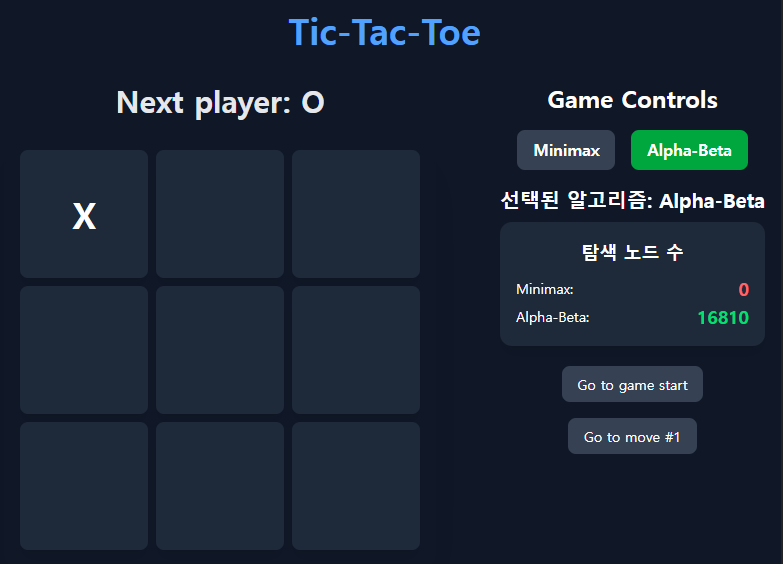

# 최대최소 탐색을 활용한 삼목게임(tic-tac-toe)

## [Click to play](https://fake-dev-log.github.io/minimax_machine/)

## Version 2. 알파-베타 가지치기($\alpha$-$\beta$ pruning)

### 개요

알파-베타 가지치기 방법을 도입하여, 기존의 최대최소 탐색에 비해 탐색량을 크게 줄일 수 있었다.

아래는 첫 수 착수에 필요한 탐색량을 비교한 것이다.

<p float="left">
  
   
</p>

약 55만 -> 약 1만 7천

### 1. 조건

1. 사람과 AI가 번갈아가며 삼목 게임을 플레이한다. 순서는 임의적으로 결정된다.
2. AI는 승리시 양의 무한대, 패배시 음의 무한대, 무승부시 0의 점수를 얻는다.

### 2. 알고리즘 개요

1. 기본적인 최대최소 탐색을 수행하면서 알파-베타 가지치기를 통해 불필요한 가지를 잘라 낸다.
2. $\alpha$는 최대화 노드의 최대화 과정에서 지금까지 구한 가장 큰 가치를 뜻한다. 후계 노드(최소화 과정)는 알파보다 더 큰 가치를 가져야만 그 최대화 노드의 가치가 될 수 있다. 그러므로 알파보다 큰 가치를 가지지 못하는 것이 확실한 다른 후계 노드를 탐색하지 않는다.
3. 반면 $\beta$는 어떤 최소화 노드의 최소화 과정에서 지금까지 구한 가장 작은 가치이다. 후계 노드(최대화 과정)는 베타보다 작아야만 그 최소화 노드의 가치가 될 수 있다. 그러므로 베타보다 작은 가치를 가지지 못하는 것이 확실한 다른 후계 노드를 탐색하지 않는다.

### 3. 구현

#### 1. evaluate 함수(개선)

게임이 종료되지 않은 경우 수행되는 평가 함수이다.

X 또는 O가 승리조건을 만족 할 수 있는 줄에 대해 점수를 평가한다.

만약 한 줄에 두개의 동일한 X 또는 O가 있다면 나머지 모든 칸의 가치를 합한 것보다 크다고 가정하여 가치를 10으로 계산하고, 한 줄에 하나의 X 또는 O가 놓여져 있으면 가치를 1로 계산한다.


```typescript
function evaluate(isAIFirst: boolean, currentState: State[]): number {
    // 점수 및 각 플레이어 초기화
    let score = 0;
    let aiPlayer: 'X' | 'O';
    let humanPlayer: 'X' | 'O';

    if (isAIFirst) {
        aiPlayer = 'X';
        humanPlayer = 'O';
    } else {
        aiPlayer = 'O';
        humanPlayer = 'X';
    }

    // 승리 조건을 포함하는 각 줄 탐색
    LINES.forEach(line => {
        let hasAI = false;
        let hasHuman = false;
        let emptyCount = 0;

        // 각 칸의 상태를 살핀다.
        line.forEach(idx => {
            const square = currentState[idx];
            if (square === aiPlayer) {
                hasAI = true;
            } else if (square === humanPlayer) {
                hasHuman = true;
            } else {
                emptyCount++;
            }
        });

        // 조건 만족시 AI를 기준으로 점수를 환산한다.
        if (hasAI && !hasHuman) {
            if (emptyCount === 1) score += 10;
            else if (emptyCount === 2) score += 1;
        } else if (hasHuman && !hasAI) {
            if (emptyCount === 1) score -= 10;
            else if (emptyCount === 2) score -= 1;
        }
    });
    
    return score;
}

// 승리 조건
const LINES = [
    [0, 1, 2],
    [3, 4, 5],
    [6, 7, 8],
    [0, 3, 6],
    [1, 4, 7],
    [2, 5, 8],
    [0, 4, 8],
    [2, 4, 6],
  ];
```

다만 기본적으로 탐색 깊이 제한을 9로 두었기 때문에 실제로 수행되지는 않는다.

#### 2. $\alpha$-$\beta$ 최소탐색 함수

게임의 종료 여부를 판단하고, 결과에 따라 가치를 반환한다.

최대 깊이 제한에 닿을 경우 평가함수를 수행하고 종료한다.

게임이 끝나지 않은 경우에는 상대방의 입장에서 AI의 보상 최대화 탐색을 고려한 최소 가치 탐색을 수행한다.

이 과정에서 후계 노드(최대화 과정)에서 나온 가치가 알파보다 작은지 확인한다. 알파보다 작은 경우 해당 노드는 최대화를 원하는 상대방(AI)에 의해 선택되지 않으므로 나머지 노드들에 대한 탐색을 수행하지 않고 지금까지 얻은 최소 가치를 반환한다.

```typescript
function minimizeAB(isAIFirst: boolean, currentState: State[], A: number, B: number, depth: number, nodesExplored: { count: number }): number {
    nodesExplored.count++;
    const winner = calculateWinner(currentState);
    const isDraw = !winner && currentState.every(Boolean);
    
    const aiPlayer = isAIFirst ? 'X' : 'O';

    if (winner !== null) {
        return winner === aiPlayer ? Infinity : -Infinity;
    }
    if (isDraw) {
        return 0;
    }
    if (depth >= DEPTH_BOUND) {
        return evaluate(isAIFirst, currentState);
    }

    const humanPlayer = isAIFirst ? 'O' : 'X';
    let minValue = Infinity;

    // 조기 탈출을 위해 가능한 상태에 대해 반복문을 사용한다.
    const emptyIndices = currentState.reduce((acc, val, idx) => val === null ? [...acc, idx] : acc, [] as number[]);

    for (const idx of emptyIndices) {
        const possibleMove = currentState.slice();
        possibleMove[idx] = humanPlayer;
        const value = maximizeAB(isAIFirst, possibleMove, A, B, depth + 1, nodesExplored);

        // 최소 가치 갱신
        minValue = Math.min(minValue, value);

        /* 만약 최소 가치가 알파(지금까지의 최대 가치)보다 작다면,
          상대방(AI)은 해당 노드를 후계로 선택하지 않는다.
          왜냐하면 앞으로의 최소화 탐색 과정에서는 더 작은 가치만을 찾아 선택할 것인데, 상대방(AI)은 가치의 최대화를 원하기 때문이다.
          따라서 상대방(AI)은 자신에게 더 작은 가치를 주는 경로를 선택에서 제외하게 되므로 나머지 경로를 탐색하지 않는다.*/
        if (A >= minValue) {
            return minValue;
        }

        // 지금까지 찾은 최소 가치를 갱신한다.
        B = Math.min(B, minValue);
    }

    return minValue;
}
```
#### 3. 최대탐색 함수

최대 탐색 함수는 최소 탐색함수와 같으나, AI의 입장에서 상대(사람)의 보상 최대화(AI의 보상 최소화) 탐색을 고려하여 최대 탐색을 수행한다.

여기서는 후계 노드(최소화 과정)에서 얻은 가치가 베타보다 큰지 확인한다. 베타(지금까지 구한 최소 가치)보다 큰 가치는 가치 최소화를 원하는 상대방(인간)의 선택에 영향을 줄 수 없으므로, 나머지 경로에 대한 탐색을 수행하지 않고 지금까지 찾은 최대 가치를 반환한다.

```typescript
function maximizeAB(isAIFirst: boolean, currentState: State[], A: number, B: number, depth: number, nodesExplored: { count: number }): number {
    nodesExplored.count++;
    const winner = calculateWinner(currentState);
    const isDraw = !winner && currentState.every(Boolean);
    
    const aiPlayer = isAIFirst ? 'X' : 'O';

    if (winner !== null) {
        return winner === aiPlayer ? Infinity : -Infinity;
    }
    if (isDraw) {
        return 0;
    }
    if (depth >= DEPTH_BOUND) {
        return evaluate(isAIFirst, currentState);
    }

    let maxValue = -Infinity;
    const emptyIndices = currentState.reduce((acc, val, idx) => val === null ? [...acc, idx] : acc, [] as number[]);

    for (const idx of emptyIndices) {
        const possibleMove = currentState.slice();
        possibleMove[idx] = aiPlayer;
        const value = minimizeAB(isAIFirst, possibleMove, A, B, depth + 1, nodesExplored);
        
        // 최대 가치 갱신
        maxValue = Math.max(maxValue, value);

        /* 마찬가지로 베타보다 큰 가치는 최소화를 원하는 상대방(인간)의 선택에 영향을 주지 못한다. 따라서 나머지 경로에 대한 탐색을 수행하지 않는다.*/
        if (B <= maxValue) {
            return maxValue;
        }

        // 지금까지 찾은 최대 가치 갱신
        A = Math.max(A, maxValue);
    }

    return maxValue;
}
```

#### 4. 탐색함수

AI의 입장에서 상대(사람)의 최소화 탐색을 고려한 최대 탐색을 알파-베타 가지치기 방식으로 수행한다.

```typescript
function minimaxAB(isAIFirst: boolean, currentState: State[]): { bestMove: number, nodesExplored: number } {
    let A = -Infinity;
    let B = Infinity;
    const nodesExplored = { count: 0 };

    const emptyIndices = currentState.reduce((acc, val, idx) => val === null ? [...acc, idx] : acc, [] as number[]);

    // 착수점을 가능한 착수점 중 첫번째로 초기화
    let bestMove = emptyIndices.length > 0 ? emptyIndices[0] : 0;

    for (const idx of emptyIndices) {
        const possibleMove = currentState.slice();
        possibleMove[idx] = isAIFirst ? 'X' : 'O';
        const value = minimizeAB(isAIFirst, possibleMove, A, B, 1, nodesExplored);

        // 알파를 갱신한다.
        if (value > A) {
            A = value;
            bestMove = idx;
        }
    }       

    return { bestMove, nodesExplored: nodesExplored.count };
}
```

